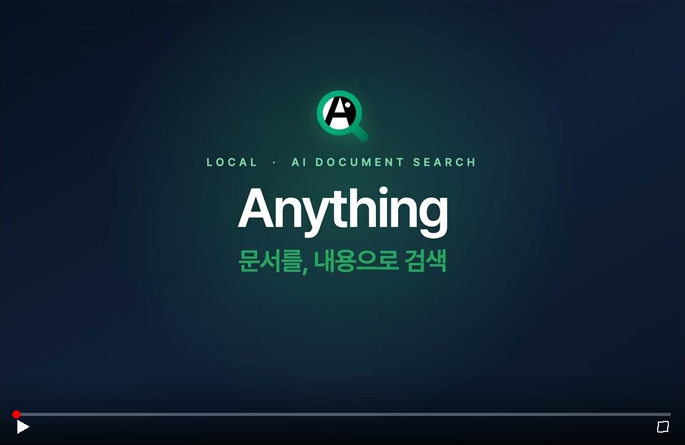
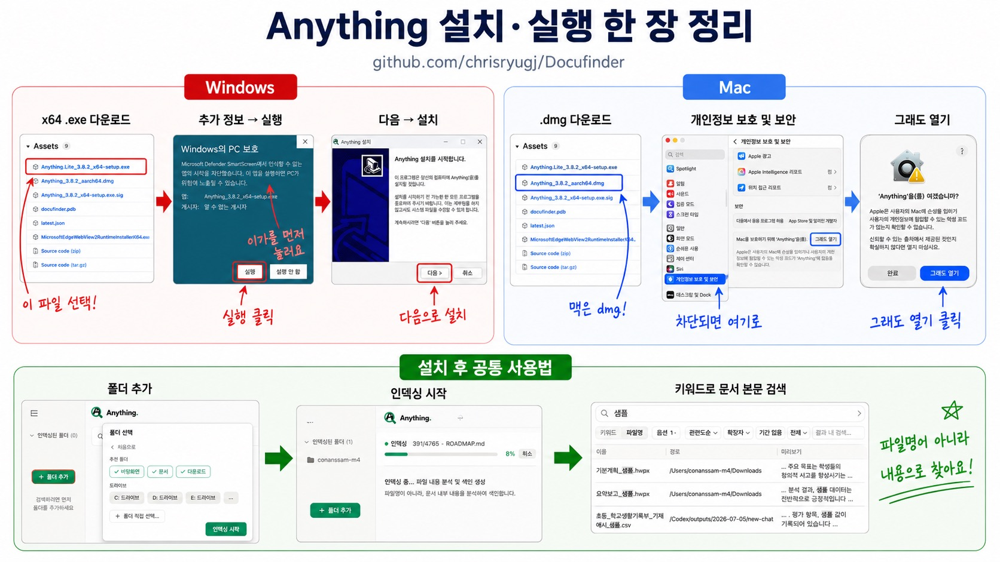

<p align="center">
  
</p>

<h1 align="center">Anything</h1>

<p align="center">
  <b>내 PC 문서를 통째로 뒤지는 100% 로컬 검색 엔진</b><br/>
  파일명을 몰라도, 열어보지 않아도 — 문서 <i>안의 내용</i>으로 찾습니다.<br/>
  한글(HWP/HWPX)·워드·엑셀·PDF·이미지까지, 전부 내 컴퓨터 안에서.
</p>

<p align="center">
  <a href="https://github.com/chrisryugj/Docufinder/releases"></a>
  &nbsp;
  <a href="https://github.com/chrisryugj/Docufinder/releases"></a>
</p>

<p align="center">
  <a href="https://github.com/chrisryugj/Docufinder/releases"></a>
  <a href="https://tauri.app"></a>
  <a href="LICENSE"></a>
</p>

<p align="center">
  <a href="https://youtu.be/xuCGvqG6_SE"></a>
</p>

<p align="center">
  <sub>▶ 클릭하면 유튜브에서 재생됩니다.</sub>
</p>

---

## 이런 걸 할 수 있습니다

### 문서 내용 검색
폴더를 등록하면 자동으로 인덱싱합니다. 검색창에 키워드를 치면 **문서 안의 본문**에서 결과를 찾아줍니다. 수천 개 문서도 1초 안에.

**몇 페이지에 있는지까지 (v3.8.1)** — HWP·HWPX·PDF 결과에 `3p` 같은 페이지 배지가 붙고, 결과를 클릭하면 미리보기가 그 페이지로 바로 이동합니다. 한컴 저장본의 조판 정보로 실제 쪽 번호를 복원하는 방식이라 **재인덱싱한 문서부터** 반영되며, 조판 정보가 없는 프로그램 생성 파일은 종전대로 페이지 없이 동작합니다.

### 파일명 검색
Everything처럼 파일명 일부만 입력하면 인메모리 캐시에서 **즉시** 찾습니다. 인덱싱이 끝나기 전에도 사용 가능. 결과는 **정렬 가능한 컬럼 뷰**(이름·경로·크기·수정일·유형)로 표시됩니다 — 컬럼을 클릭해 정렬하고, 경계를 드래그해 너비를 조절(더블클릭 시 자동 맞춤)하며, 헤더 우클릭으로 경로·크기·수정일 컬럼을 켜고 끌 수 있습니다. 너비·정렬·표시 설정은 자동 저장됩니다.

### AI 질의응답 (선택)
"2026년 예산 얼마야?", "연차 조건이 뭐야?" 같은 자연어 질문을 하면 인덱싱된 문서에서 관련 부분을 찾아 답변합니다. **근거 문서 + 페이지**까지 표시. 답변 아래 **'MD 저장'** 버튼으로 질문·답변·참조 문서를 마크다운 한 파일로 남길 수 있습니다. Gemini 또는 OpenAI 호환 서버(vLLM·Ollama·LiteLLM 등 사내·오프라인 LLM 포함)의 API 키가 필요하며, 없어도 검색은 정상 동작합니다.

### AI 문서 요약 (선택)
파일 우클릭 → 요약. 계약서, 보고서, 회의록 등 문서 타입에 맞춰 핵심만 뽑아줍니다. 요약은 AI 제공자(Gemini 또는 OpenAI 호환 서버)를 호출하므로 API 키 설정이 필요합니다.

### 실시간 동기화
파일을 추가/수정/삭제하면 자동으로 반영됩니다. 수동 재인덱싱 필요 없음.

### 문서 미리보기 & 크게 보기
결과를 클릭하면 문서를 미리보기로 렌더합니다. 병합·중첩된 표도 원본 구조 그대로 표시하고, 전체화면 팝업 뷰어에서 커서 기준 휠 줌·더블클릭 확대·너비/페이지 맞춤으로 크게 볼 수 있습니다. Ctrl+F로 문서 안에서 바로 찾기도 됩니다.

**원본 레이아웃 보기 (v3.2)** — 텍스트 미리보기 외에 원본 조판 그대로 보는 뷰를 지원합니다(단축키 `1` 문서 텍스트 / `2` 원본 레이아웃). `.hwpx`(kordoc SVG — 글꼴·가로문서·다구역까지 충실 렌더), `.pdf`(원본 페이지 이미지), **`.hwp`(rhwp 네이티브 렌더 — 한컴 설치 없이)** 삼종 모두.

**암호 걸린 문서 열기 (v3.6)** — 열기 암호가 걸린 HWPX·HWP(HWP3/HWP5) 문서는 미리보기에서 비밀번호를 입력해 볼 수 있습니다. 암호는 그 문서를 여는 데만 쓰고 저장하지 않으며, 인덱싱 경로는 종전대로 암호 문서를 건너뜁니다.

### Markdown으로 내보내기
검색 결과를 우클릭 → **'Markdown으로 저장'** 하면 문서 본문을 `.md` 파일로 바로 뽑아냅니다 (v3.8.2). 미리보기를 열 필요가 없어서, 미리보기를 거치지 않는 **파일명 검색 결과에서도** 저장됩니다. 파서가 읽는 포맷(hwp·hwpx·docx·pptx·xlsx·xls·pdf·txt·md·eml)에만 메뉴가 뜨고, 암호 걸린 문서는 미리보기에서 암호를 입력한 뒤 저장하도록 안내합니다.

### 문서 비교
같은 문서의 버전이 여러 개일 때, 결과 우클릭 → '비교 대상으로 선택' 후 다른 결과와 비교하면 두 문서의 달라진 부분을 나란히 보여줍니다.

### 파일 드래그아웃
검색 결과를 다른 앱이나 웹 페이지로 바로 끌어다 놓을 수 있습니다 (파일 탐색기 드래그와 동일). **Shift를 누른 채 드래그하면 복사 대신 이동**합니다.

---

## 지원 파일 형식

| 형식 | 확장자 | 비고 |
|------|--------|------|
| 한글 | `.hwpx` `.hwp` | HWP5 + **HWP3 (1996~2002 구버전)** kordoc 엔진으로 자동 변환 |
| 워드 | `.docx` | |
| 파워포인트 | `.pptx` | |
| 엑셀 | `.xlsx` `.xls` | 시트·행 위치까지 추적 |
| PDF | `.pdf` | 스캔 PDF OCR · 수식(LaTeX) 인식 — 설정에서 켜기 |
| 이미지 | `.jpg` `.jpeg` `.png` `.webp` `.bmp` `.tiff` | OCR로 텍스트 추출 — 설정에서 켜기 |
| 텍스트 | `.txt` `.md` | EUC-KR/CP949 자동 감지 |
| 메일 | `.eml` | 제목·보낸사람·받는사람·본문 검색 (charset 자동 디코딩) |

> **사내 보안솔루션(DRM)으로 문서가 암호화된 환경이라면 (v3.8, Windows 전용·기본 꺼짐)** — 허가된 프로그램 외에는 파일이 깨진 것으로 보여 위 파서가 전부 실패합니다. 이때 **설정 → 검색 탭**에서 '설치된 MS 오피스로 파일 읽기'를 켜면, 회사가 공식 허가한 MS Word·Excel·PowerPoint 를 통해 본문을 읽어 인덱싱합니다. **기존 파서가 실패한 파일에만** 동작하는 최후 fallback 이고, Office 창은 화면에 뜨지 않으며 매크로 자동실행은 차단됩니다.

---

## 설치

<p align="center">
  
</p>

<p align="center">
  <sub>이미지 출처: <b>코난쌤</b></sub>
</p>

### 다운로드 — 어느 파일을 받아야 하나?

[Releases](https://github.com/chrisryugj/Docufinder/releases) 페이지에서 본인 환경에 맞게 받으세요.

| 내 PC 상황 | 받을 파일 | 크기 |
|------------|-----------|------|
| 집 / 개인 PC, Windows 10 (21H2 이상) / Windows 11 | **`Anything_<버전>_x64-setup.exe`** 하나만 | ~380 MB |
| 회사 PC인데 관리자 권한이 없거나, Windows 10 LTSC 같은 구버전, 또는 첫 실행 때 WebView2 오류가 떴던 분 | **`Anything_<버전>_x64-setup.exe`** + **`MicrosoftEdgeWebView2RuntimeInstallerX64.exe`** | ~380 MB + ~199 MB |
| 내부망 PC 인데 보안솔루션(안랩 V3·ZombieZERO 등)이 앱을 격리하거나 기동을 막는 경우 | **`Anything.Lite_<버전>_x64-setup.exe`** ([아래 참고](#anything-lite--내부망-전용-배포본-v370)) | ~280 MB |

> **WebView2 런타임이 핵심입니다.** 이 앱은 Windows 의 Microsoft Edge WebView2 런타임 위에서 화면을 그립니다. 개인 PC 는 보통 이미 깔려 있어 setup 하나로 끝나지만, WebView2 가 없는 회사 PC / LTSC 환경에서는 `MicrosoftEdgeWebView2RuntimeInstallerX64.exe` 를 **먼저(가능하면 관리자 권한으로)** 설치한 뒤 앱 setup 을 실행하세요.

**공통 요건**
- RAM 8GB 이상 (16GB 권장) · 디스크 여유 1GB 이상
- **설치본만으로 검색·인덱싱·OCR 이 동작**합니다 — 기본 설정에서는 실행 중 내려받는 파일이 없습니다 (v3.4.3+)
- 설정에서 **직접 켜는 선택 기능**만 예외입니다 — 시맨틱(의미) 검색(임베딩 모델 약 106MB), 수식(LaTeX) 인식, 레이아웃 분석은 처음 켤 때 각각 모델을 1회 내려받습니다
- 이후 새 버전이 나오면 앱 안에서 자동으로 알려줍니다 (Lite·macOS 는 수동 업데이트)

**오프라인 사내망 / 망간(단방향) 전송 PC 에 설치하려면**

> 과거의 통합본(`...-ltsc-setup.exe`, ~573MB)은 망간 전송에서 파일이 깨지거나 실행이 안 되는 문제로 폐기했습니다. 아래처럼 **두 파일을 나눠서** 옮기세요 (이슈 #29 제보자 검증 — 큰 단일 파일보다 전송 성공률이 높습니다).

1. 인터넷 가능한 PC 에서 두 파일을 받기
   - `Anything_<버전>_x64-setup.exe`
   - `MicrosoftEdgeWebView2RuntimeInstallerX64.exe`
2. 두 파일을 **각각** USB / 망간 전송으로 사내 PC 로 옮기기 (한 번에 하나씩)
3. 사내 PC 에서 **`MicrosoftEdgeWebView2RuntimeInstallerX64.exe` 를 먼저 설치** (가능하면 관리자 권한)
4. 이어서 `Anything_<버전>_x64-setup.exe` 더블클릭 — 끝
   - WebView2 가 이미 있는 PC 라면 1번에서 앱 setup 하나만 옮겨도 됩니다.

> OCR 엔진·스캔 PDF 처리에 필요한 파일은 모두 설치본에 들어 있어 실행 중 내려받지 않습니다
> (v3.4.3+). 네트워크 시도 자체를 원천 차단하고 싶다면 시스템 환경변수
> **`DOCUFINDER_OFFLINE=1`** 을 설정하세요 (선택 — 평상시엔 필요 없습니다).
> 이 스위치를 켜면 '레이아웃 분석'(온라인 전용 선택 기능)만 조용히 비활성되고, OCR 본체와
> 검색·인덱싱은 그대로 동작합니다.

### Anything Lite — 내부망 전용 배포본 (v3.7.0+)

내부망 PC 에서 보안솔루션(안랩 V3·ZombieZERO 등)이 앱을 격리하거나 기동 자체를 막는 경우가 있었습니다. 증상마다 우회하는 대신 **탐지 표면을 컴파일 단계에서 들어낸 별도 빌드**를 릴리스에 함께 올립니다 — `Anything.Lite_<버전>_x64-setup.exe` (~280 MB, Windows 전용). 인터넷이 되는 PC 는 기존 `Anything_<버전>_x64-setup.exe` 를 쓰시면 됩니다.

- **네트워크 코드가 물리적으로 없습니다.** HTTP 클라이언트를 링크조차 하지 않아 바이너리에 HTTP/TLS 스택과 외부 호스트 문자열이 남지 않습니다. IT 부서가 `strings` 로 직접 확인할 수 있고, CI 가 릴리스마다 이를 자동 검증합니다.
- **빠지는 기능**: 시맨틱/하이브리드 검색 · OCR · AI 질의응답·요약 · 자동 업데이트 · 오류 자동 리포트.
- **남는 기능**: 전문 검색(FTS5 + 한국어 형태소·근접 검색·검색 연산자), 파일명 검색, HWP/HWPX/DOCX/XLSX/PDF·`.eml` 파싱과 미리보기, 실시간 감시·증분 인덱싱, 문서 비교, 버전 계보, 태그·북마크, 중복 찾기, 내보내기.
- 일반 배포본의 `settings.json` 을 그대로 가져오거나 파일을 손으로 고쳐도 시맨틱·OCR·AI 가 되살아나지 않습니다. 설정·DB 도 일반 배포본과 분리 저장됩니다.
- Lite 도 `node.exe`(kordoc 사이드카 — HWP 파싱 필수)와 `msedgewebview2.exe`(UI 렌더러)는 자식 프로세스로 띄웁니다. 차단 정책이 있으면 이 둘의 예외 등록이 필요합니다.
- **코드 서명은 여전히 미적용입니다.** Lite 는 탐지 표면을 최소화할 뿐 서명을 대신하지 못합니다.

배경·제외 목록·IT 부서 제출용 근거는 [docs/LITE-BUILD.md](docs/LITE-BUILD.md) 를 참고하세요.

<details>
<summary><b>설치 시 보안 경고가 뜰 때</b> (클릭)</summary>

개인 개발 앱이라 Microsoft 코드서명 인증서(연 수십만 원)가 없어서 경고가 표시됩니다. **악성코드가 아니며**, 소스코드는 전부 이 저장소에서 확인할 수 있습니다.

**1. "Windows의 PC 보호" 파란 창**
- 좌측 하단 **"추가 정보"** 클릭
- 아래쪽 **"실행"** 버튼 클릭

**2. "스마트 앱 컨트롤이 차단" (Windows 11)**
- 파일 탐색기에서 설치 파일(.exe) **우클릭 → 속성**
- 하단 **"차단 해제"** 체크 후 적용
- 다시 더블클릭으로 실행

**3. 다운로드 자체가 막힐 때 (Edge/Chrome)**
- 브라우저 다운로드 창에서 **"..."(점 3개)** → **"유지"** 선택
- Edge: **"안전하지 않은 파일 유지"** 링크 클릭

**4. 백신이 파일을 자동 격리/삭제할 때**
- Windows Defender: 설정 → "바이러스 및 위협 방지" → "보호 기록"에서 **복원**
- 타사 백신 (V3, 알약 등): 실시간 감시 일시 중지 후 재시도
- 기업 PC는 IT 관리자 문의 (AppLocker 정책)

**5. 설치 후 앱이 안 열릴 때**
- `%APPDATA%\com.anything.app\crash.log` 내용과 함께 [Issues](https://github.com/chrisryugj/Docufinder/issues) 제보

**6. "WebView2 런타임 오류" 가 떠서 앱이 안 열려요**
- 다이얼로그에 *"You may have it installed on another user account..."* 같은 영문이 보이거나, "WebView2" 가 어쩌고 하는 오류로 시작 자체가 안 되는 경우.
- **해결: `MicrosoftEdgeWebView2RuntimeInstallerX64.exe` 를 받아 (가능하면 관리자 권한으로) 설치한 뒤 앱을 다시 실행하세요.** 기존 앱은 제거하지 않아도 됩니다.
- 인덱싱 / 폴더 설정 등 사용자 데이터는 그대로 보존됩니다.
- 이래도 안 열리면 `%APPDATA%\com.anything.app\logs\` 안의 최신 로그 파일과 함께 [Issues](https://github.com/chrisryugj/Docufinder/issues) 로 제보해 주세요.

</details>

### macOS (Apple Silicon)

[Releases](https://github.com/chrisryugj/Docufinder/releases) 페이지에서 `.dmg` 파일을 받아 실행.

- **macOS 11 (Big Sur) 이상** · Apple Silicon (M1/M2/M3) 전용
- Intel Mac 미지원 (필요 시 [Issues](https://github.com/chrisryugj/Docufinder/issues)에 요청)
- RAM 8GB 이상 권장 · 디스크 여유 1GB 이상
- **자동 업데이트 미지원** — 새 버전은 수동 다운로드

**설치 순서**
1. `.dmg` 더블클릭 → Applications 폴더로 드래그
2. **첫 실행만**: Applications 폴더에서 Anything 우클릭 → "열기" → 경고창에서 다시 "열기"

**"Apple은 'Anything'에 악성 코드가 없음을 확인할 수 없습니다" 팝업이 뜰 때** (macOS 15 Sequoia 이상)

macOS 15부터는 우클릭 → "열기" 우회가 막혀 위 팝업에 "열기" 버튼이 없습니다. 두 방법 중 하나로 열 수 있습니다.

- 팝업에서 "완료" 클릭 → **시스템 설정 → 개인정보 보호 및 보안** → 하단 "'Anything'이(가) 차단되었습니다" 옆 **"그래도 열기"** → 다시 실행
- 또는 터미널에서 quarantine 속성 제거:

```bash
xattr -dr com.apple.quarantine /Applications/Anything.app
```

**"손상된 앱"으로 표시될 때** (Gatekeeper quarantine)

```bash
xattr -dr com.apple.quarantine /Applications/Anything.app
```

> Apple Developer ID 인증서 미보유로 ad-hoc 서명만 적용되어 있습니다. 악성코드가 아니며 소스는 이 저장소에서 확인 가능합니다.

---

## 사용법

1. 앱 실행 → 좌측 **"폴더 추가"** → 문서 폴더 선택 (자동 인덱싱 시작)
2. 검색창에 입력 → 결과 클릭으로 미리보기, 더블클릭으로 파일 열기
3. (선택) 검색바 모드를 'Anything'으로 바꿔 질문 → 문서 기반 AI 답변 (설정 → AI 탭에서 API 키 등록)

### 검색 모드

| 모드 | 설명 |
|------|------|
| 키워드 | 기본값. 정확한 단어 매칭 + 아래 검색 연산자 |
| 파일명 | Everything 스타일 파일명 즉시 검색 |
| 스마트 (자연어) | "작년 예산 한글 문서"처럼 말로 조건 조합 — 검색바 토글 |
| Anything (질문) | 문서를 근거로 AI가 답변, 출처 문서·페이지 표시 — 검색바 토글 |

> 설정에서 시맨틱(AI) 검색을 켜면 유사 문서 찾기·유사 중복 탐지와 AI 질의응답의 근거 검색에 의미(벡터) 검색이 활용됩니다.

**검색 연산자** (키워드 모드) — 검색창에서 바로 조합:

| 연산자 | 예 | 동작 |
|--------|-----|------|
| `"구문"` | `"예산 삭감"` | 정확한 구문(인접 순서) |
| `-제외` | `예산 -초안` | 해당 단어 제외 |
| `ext:` | `ext:hwp,pdf` | 확장자 필터 (레거시 그룹 자동 확장) |
| `path:` | `path:인사` | 폴더 경로 필터 |
| `after:` `before:` | `after:2024-06` | 수정일 범위 |
| `~N` | `예산 삭감 ~10` | 형태소 인지 근접 검색 (N토큰 이내) |

---

## 보안 & 데이터 흐름

**AI 기능을 끄면 문서와 검색어가 밖으로 나가는 경로가 사라집니다.** 그때 남는 아웃바운드는 자동 업데이트 확인 하나뿐이고 이것도 설정에서 끌 수 있습니다. 네트워크 코드가 아예 없는 빌드가 필요하면 [Anything Lite](#anything-lite--내부망-전용-배포본-v370) 를 쓰세요.

| 기능 | 데이터 위치 | 외부 전송 |
|------|------------|----------|
| 문서 파싱·인덱싱 | 로컬 SQLite | 없음 |
| 키워드·시맨틱 검색 | 로컬 FTS5 + 벡터 DB | 없음 |
| 임베딩 (KoSimCSE) | 로컬 ONNX 모델 | 없음 |
| OCR (PaddleOCR) | 로컬 ONNX 모델 | 없음 |
| 파일명 검색 | 로컬 인메모리 캐시 | 없음 |
| AI 질의응답 | **Gemini / OpenAI 호환** | 질문 + 관련 청크만 전송 |
| AI 요약 | **Gemini / OpenAI 호환** | 문서 텍스트 전송 |
| 오류 리포트 | 로컬 로그 파일 | **기본 꺼짐** — 켠 경우에만 오류 메시지·마스킹된 경로 전송 (문서 내용·검색어 제외) |

- **원본 파일은 절대 복사되지 않습니다** — 인덱스만 생성
- **AI 기능은 설정에서 완전히 비활성화** 가능 → 순수 로컬 검색 도구로 동작
- **API 키는 사용자 PC 로컬에만 저장** — 서버를 거치지 않음
- **자동 업데이트 확인**은 GitHub Releases 엔드포인트만 조회 (비활성화 가능)

---

## 아키텍처

```
┌─────────────────────────────────────────────────┐
│  React 19 + TypeScript + Tailwind CSS           │  ← UI
├─────────────────────────────────────────────────┤
│  Tauri 2 IPC                                    │  ← 브릿지
├─────────────────────────────────────────────────┤
│  Rust Backend (Clean Architecture)              │
│  ┌───────────┬───────────┬────────────────────┐ │
│  │  Parsers  │  Indexer  │  Search Engine     │ │
│  │  hwpx     │  FTS5     │  키워드 (FTS5)     │ │
│  │  docx     │  벡터     │  시맨틱 (usearch)  │ │
│  │  xlsx     │  파일감시  │  하이브리드 (RRF)  │ │
│  │  pdf/ocr  │           │  파일명 (캐시)     │ │
│  │  txt      │           │                    │ │
│  └───────────┴───────────┴────────────────────┘ │
│  ┌────────────────────────────────────────────┐  │
│  │  SQLite (FTS5) · usearch (HNSW) · ONNX    │  │  ← 저장소
│  └────────────────────────────────────────────┘  │
└─────────────────────────────────────────────────┘
```

| 영역 | 기술 |
|------|------|
| Frontend | React 19, TypeScript 5.9, Tailwind CSS 4 |
| Backend | Rust 2021, Tauri 2.10 |
| 검색 | SQLite FTS5 + usearch HNSW + RRF 병합 |
| 한국어 처리 | Lindera 2.0 형태소 분석 |
| 임베딩 | ONNX Runtime, KoSimCSE-roberta (768차원) |
| AI | Gemini · OpenAI 호환 provider (RAG) |
| OCR | PaddleOCR ONNX + PP-DocLayout 레이아웃 분석 |
| HWP 파싱 | [kordoc](https://www.npmjs.com/package/kordoc) (번들 포함) |
| HWP 원본 레이아웃 | [rhwp](https://github.com/edwardkim/rhwp) — Rust 네이티브 렌더 (한컴 설치 불필요) |

---

## 개발자용

```bash
# `pnpm run bundle-kordoc` 에 필요
git clone https://github.com/chrisryugj/kordoc # Docufinder 폴더 바깥에 클론
cd kordoc
npm install
npm run build
```

```bash
pnpm install          # 의존성 설치
pnpm run download-model  # ONNX 모델 다운로드 (첫 빌드 시)
pnpm run bundle-kordoc # kordoc 및 node.exe 번들링 (첫 빌드 시, kordoc 업데이트 시)
pnpm tauri:dev        # 개발 모드
pnpm tauri:build      # 프로덕션 빌드 (NSIS 설치파일 .exe)
pnpm run tauri:build:lite  # 내부망 전용 Lite 빌드 (docs/LITE-BUILD.md)
```

**빌드 요구사항**: Windows 10/11 x64 · Node.js 22 LTS + pnpm 10 · Rust 1.92+ · Visual Studio Build Tools 2022

**macOS (Apple Silicon)** — `setup-mac-resources` 를 먼저 돌려야 합니다. node·kordoc·dylib 들은 저장소에 없어서, 안 돌리면 Tauri 리소스 검증이 "resource path doesn't exist" 로 실패합니다(`cargo test` 포함).

```bash
pnpm run setup-mac-resources  # node + kordoc + ONNX/pdfium dylib 채우기 (첫 빌드 시)
pnpm run tauri:dev:mac
pnpm run tauri:build:mac      # aarch64-apple-darwin (.dmg)
```

**릴리스**: `./scripts/release.sh X.Y.Z` — CI 와 같은 검증을 로컬에서 먼저 돌리고, 전부 통과해야만 태그를 만들어 푸시합니다.


---

## FAQ

<details>
<summary><b>폐쇄망/내부망에서 쓸 수 있나요?</b></summary>
네. AI 기능을 끄면 문서·검색어가 외부로 나가지 않고, 검색·인덱싱·OCR 은 설치본에 들어 있는 파일만으로 동작합니다(v3.4.3+). 시맨틱(의미) 검색까지 쓰려면 임베딩 모델 파일만 수동으로 복사해 넣으면 됩니다. 보안솔루션이 앱을 격리하는 환경이라면 네트워크 코드 자체가 없는 [Anything Lite](#anything-lite--내부망-전용-배포본-v370) 를 쓰세요.
</details>

<details>
<summary><b>파일이 외부로 전송되나요?</b></summary>
AI 질의응답을 쓸 때만 질문과 관련된 텍스트 조각이 설정한 AI 제공자(Gemini 또는 OpenAI 호환 서버)로 전송됩니다. 사내·로컬 LLM 을 endpoint 로 지정했다면 그 조각도 사내 네트워크 밖으로 나가지 않습니다. AI를 끄면 전송되는 데이터는 없습니다. 원본 파일은 어떤 경우에도 외부로 나가지 않습니다.
</details>

<details>
<summary><b>HWP 파일도 검색되나요?</b></summary>
네. kordoc 엔진이 앱에 내장되어 있어서 한컴오피스 없이도 .hwp 파일을 파싱합니다.
</details>

<details>
<summary><b>인덱싱은 얼마나 걸리나요?</b></summary>
SSD 기준 약 1,000개 문서에 2~5분. FTS 인덱싱이 먼저 완료되어 바로 검색할 수 있고, 벡터 인덱싱은 백그라운드에서 이어집니다.
</details>

---

## 라이선스

[Business Source License 1.1](LICENSE) — Copyright 2025-2026 chrisryugj

- 비프로덕션(개발·테스트·학습) 자유 사용
- 프로덕션/상용은 별도 라이선스 필요
- 2030-04-15 이후 Apache License 2.0 자동 전환

상용 라이선스 문의: ryuseungin@gmail.com

배포본에 포함되는 제3자 저작물(PDFium, ONNX Runtime, PaddleOCR, Node.js,
Pretendard, kordoc 및 그 의존성)의 저작권·라이선스 고지는
[THIRD_PARTY_NOTICES.md](THIRD_PARTY_NOTICES.md) 를 참조. 위 BUSL 조건은
제3자 저작물에는 적용되지 않는다.

---

버그 리포트·기능 제안은 [Issues](https://github.com/chrisryugj/Docufinder/issues)에서 환영합니다.
